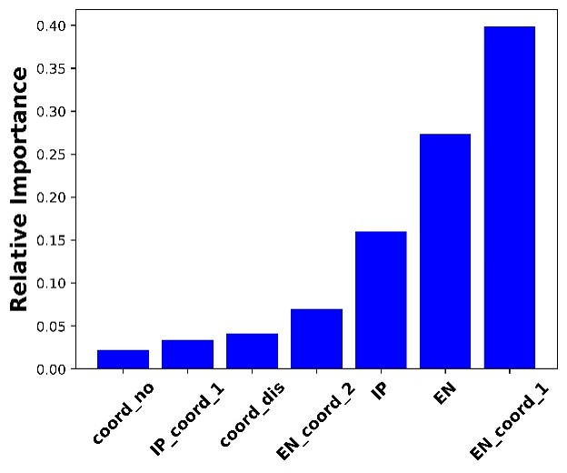
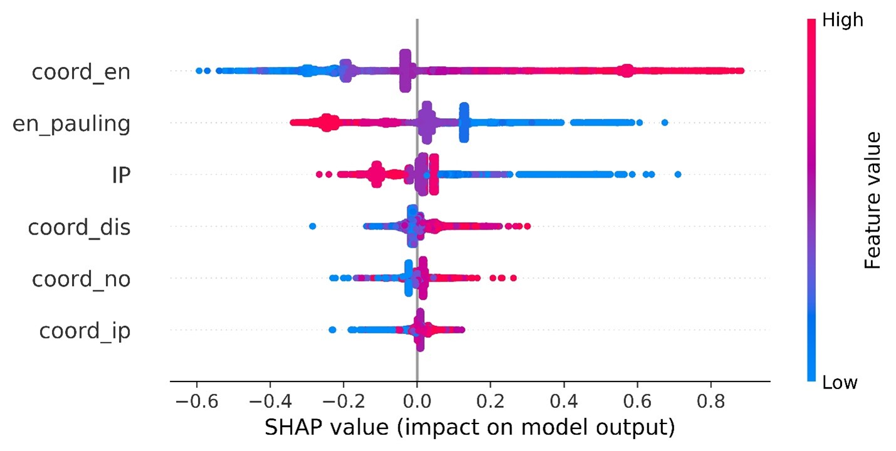
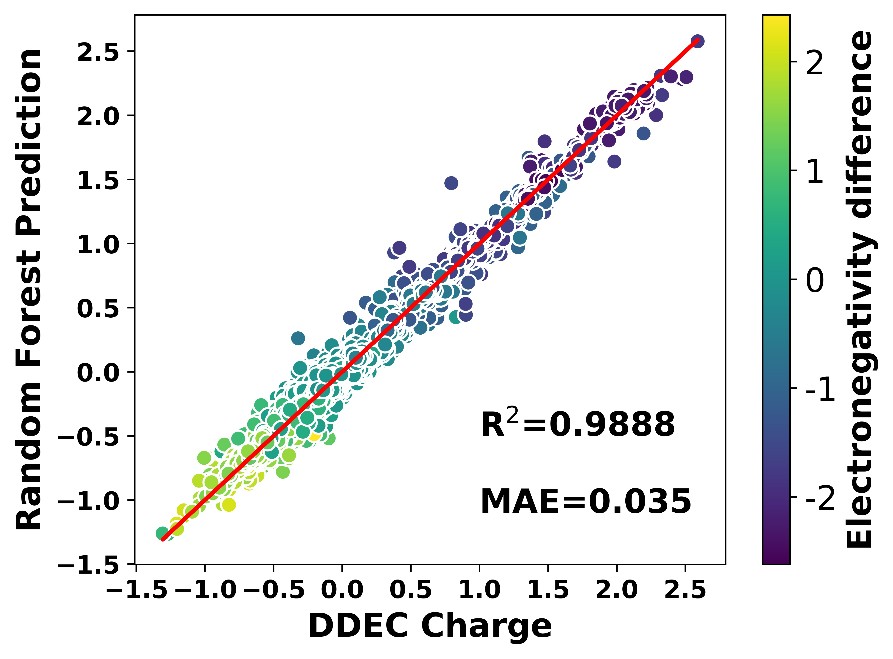
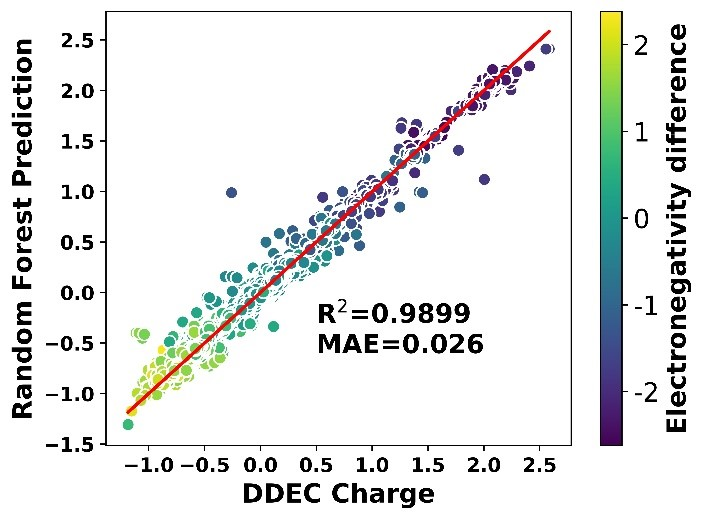
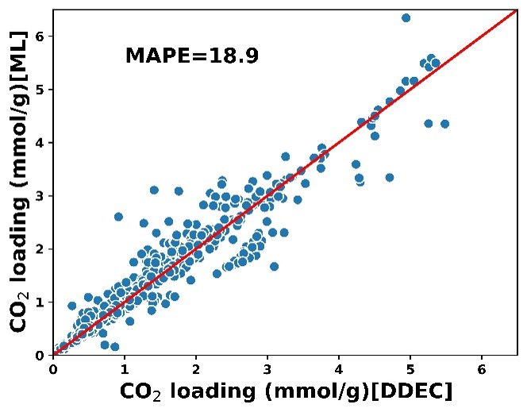
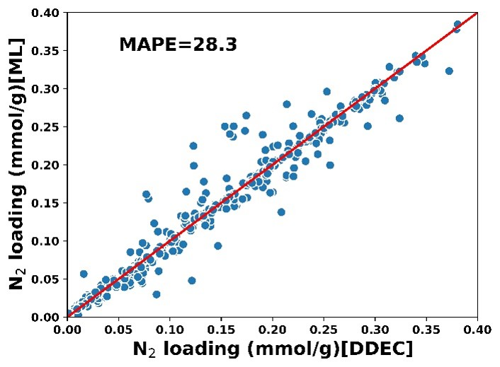
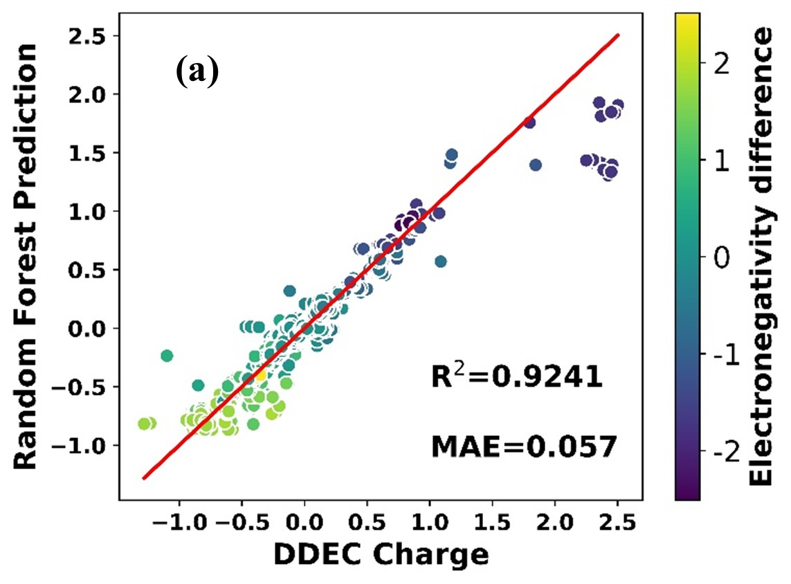
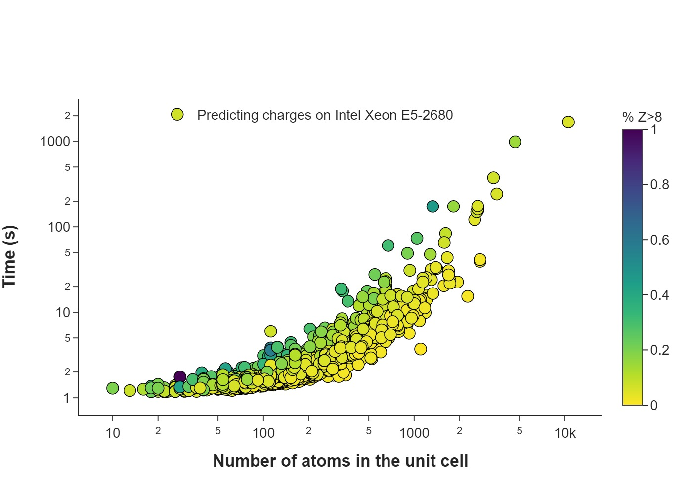
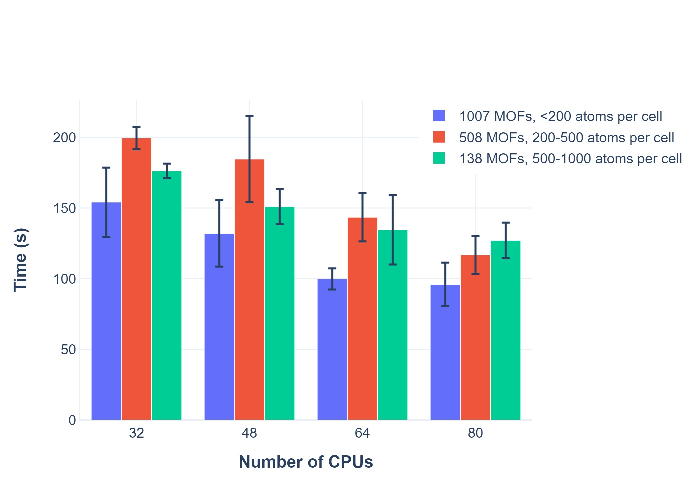

.. image:: https://travis-ci.com/arung-northwestern/pacmof.svg?token=aVxN4HyzqyiRuqPvtZRU&branch=master
    :target: https://app.travis-ci.com/arung-northwestern/pacmof.svg?branch=master

Partial Atomic Charges in Metal-Organic Frameworks (PACMOF) from Machine Learning
**********************************************************************************
Check out our publication_ in JCTC!

.. _contents:

Contents

- Overview_
- Installation_
- Usage_
- Development_
- Citation_

.. _overview:

Overview
***********
[contents_]

PACMOF is a small and easy to use python library that uses machine Learning to quickly estimate partial atomic charges in
metal-organic frameworks. The pre-trained Random Forest model (Scikit-learn) in PACMOF generates high-quality charges of the same accuracy as that of
Density Derived Electrostatic and Chemical (DDEC), but without needing hours of periodic-DFT calculations. PACMOF is made with high-throughput screening
in mind, where you can get charges on a large number of CIF files in parallel, using a Dask_ backend with options to write the output charges into new CIF files, and to 
use user-trained machine learning models instead of the pre-trained one (compiled during installation). Please find more information about the method and implementation
in our publication_. The inspiration for this work came from this paper_,
where each atom in a MOF is described by a list of the elemental and the local environmental features. However, we chose a slightly different set of features to train our ML model namely,

- Electronegativity (elemental)
- First ionization energy (elemental)
- Number of atoms in the first coordination shell (local environment).
- The average electronegativity of the first coordination shell (local environment). 
- The average coordination distance of the coordinated atoms (local environment) .
- The average ionization energy of the first coordination shell (local environment).
- The average electronegativity of the second coordination shell (local environment).

Among these features, we found that the elemental electronegativity and the average electronegativity of the
first coordination shell are by far the most important features when it comes to predicting partial charges.

The relative feature importance is summarized in the figure below

And the feature impact on the final predictions is summarized by the SHAP_ value plot

.. _installation:

Installation
*****************

[contents_]

    PACMOF requires the following packages to work, we recommend installing these ahead of time using conda_ to ensure the integrity of your conda_ environment

    .. code-block:: bash

        conda install -c conda-forge "numpy>=1.13.3" "pymatgen>=2018.6.11" "ase>=3.19" "tqdm>=4.15" "pandas>=0.20.3" "scikit-learn>=0.19.1" "joblib>= 0.13.2" "pytest>=5.0.1" "dask[complete]" "dask-jobqueue>=0.6.2" "fsspec>=0.7.4"

For the latest version, please clone this repo and use the included *setup.py* to install, as shown below (*recommended*)

.. code-block:: bash

    cd pacmof
    python setup.py install

**Note**: PACMOF shouldn't be installed using 'pip', as it doesn't allow the execution of post install commands. To ensure compatibility with your version of Scikit-learn and to save the memory overhead, PACMOF trains and persists the ML model locally, post install.

.. _pip: https://pypi.org/project/pip/
.. _PyPI: https://pypi.org/

.. _Usage:

Usage
*******
[contents_]

What can PACMOF do ?
---------------------

PACMOF calculates partial charges in MOFs in serial or parallel using CIF files as input. PACMOF uses a Dask_ backend to do calculations in 
parallel which is useful in processing large CIFs or for interactive high-throughput screening. 

 All the functions return an ASE_ style atoms object (or a list of objects) with the *features included under atoms.info['features'],
 and the charges included under the atoms.info['_atom_site_charges']* dictionaries respectively. 
 Functions are well documented in their docstrings and can be availed using *'help(function_name)'*. 
 The general capabilities of PACMOF can be summarized as follows:

Serial Calculations
--------------------
- Compute the charges from a CIF file.

This is sufficient for most CIF files, where the number of atoms per unit cell is less than 2000.

.. code-block:: python

    data = pacmof.get_charges_single_serial(path_to_cif, create_cif=False)

- Compute the features for any CIF, this might be useful for training your own machine learning model.

.. code-block:: python

    data = pacmof.get_features_from_cif_serial(path_to_cif)

Parallel Calculations
----------------------

Since PACMOF uses a Dask_ backend, you can run calculations in parallel on a single CPU using Dask_, with or without starting a Dask cluster.

- Calculations on a list of CIFs in parallel

PACMOF can be used to run calculations on a list of CIFs in one line, where each calculation is run in parallel 

    - Compute the charges for a list of CIFs in parallel, on a single CPU or using a dask cluster. This is recommended for most cases. 

    .. code-block:: python

        data = pacmof.get_charges_multiple_parallel(list_of_cifs, create_cif=False)

this saves time by using all multiple cores and by not having to reload the ML model for each CIF file.

- Calculations on a large CIF with more than 2000 atoms

For CIFs with more than say 2000 atoms calculations in serial can be too slow, in those cases PACMOF can be used to calculate charges (or features) quickly in parallel for a single CIF file.

    - Compute the charges for one large CIF in parallel using Dask_

    .. code-block:: python

        data = pacmof.get_charges_single_large(path_to_cif, create_cif=False)

    - Compute the features for a large CIF in parallel using Dask_, might be useful for training your own ML model.

    .. code-block:: python

        data = pacmof.get_features_from_cif_parallel(path_to_cif)

- High-throughput charges using PACMOF
---------------------------------------

If you plan on doing high-throughput screening with many CIF files, you could start a Dask cluster before
calling any of the get_charges_multiple_parallel/onebyone functions, to run calculations in parallel on an HPC. 

For example, to start a cluster with 10 processes with 8 CPUs per process on an HPC that uses SLURM_ use,

.. code-block:: python

    from dask_jobqueue import SLURMCluster
    from dask.distributed import Client
    cluster=SLURMCluster(cores=8, interface='ib0', project='p20XXX', queue='short', walltime='04:00:00', memory='100GB')
    cluster.scale(10)
    client= Client(cluster)

   Note: Please refer to the dask documentation on setup_ for use with other queuing systems and more.

**The inner workings of parallel computing in PACMOF**

Note: For more info the function arguments, please refer to the source code file pacmof.py in PACMOF or use help(function_name).

Dask_ offers a following scheduler options for executing the task graphs for partial charge calculation.

+ *Threaded scheduler:* Not suitable for parallel calculations using objects due to the Global Interpreter Lock (GIL) in Python.
+ *Multi-processing scheduler:* Good for single CPU calculations with a few processes (workers) where the computation overhead from data sharing can be readily avoided.
+ *Distributed scheduler (preferred):* The most advanced of the Dask_ schedulers, provides versatility through concurrent futures_ . Large data such as the structure information might have to be pre-distributed to the processes to avoid any computational bottlenecks from data transfer. Allows for the use of the advanced Dask dashboard_ to keep track of the calculations in real-time.

PACMOF uses dask_bag_ for parallel computations, which defaults to the process-based scheduler, this is enough when using one or a few CPUs in parallel. If a  dask cluster is started beforehand, Dask_ detects that a cluster is active and automatically switches to the more robust distributed scheduler for its calculations. Further, all the parallel functions listed below support a *client_name* argument to specify the scheduler explicitly. The '*client_name*' is recommended to be one of the following:

- a object of the dask.distributed.Client type, like the 'client' variable initiated in the code snippet above. Uses the distributed_ scheduler
- Keyword 'processes' to use the process-based scheduler
- if no *client_name* is specified and no cluster is initiated, the process-based scheduler is used by default.

We recommend using the distributed scheduler always, and specifying the '*client_name*' explicitly to ensure robustness for calculations on both single machines and HPCs.

    Note: To use the distributed scheduler on a single-machine, initialize a local cluster and then pass
    that as the client_name to the parallel routine in PACMOF

    .. code-block:: python

        from dask.distributed import Client, LocalCluster
        cluster=LocalCluster()
        client= Client(cluster)

        data = pacmof.get_charges_multiple_parallel(list_of_cifs, create_cif=False, client_name=client)

    
    Note: Please refer to the docstring from help() to see the options on writing the output CIF file or to use a different machine learning model other than the one included.

    - Compute the charge for a list of large CIFs, one by one, where each calculation is run in parallel using Dask_. This is recommended when all of the CIFs have more than 2000 atoms each, if not the memory overhead for parallelizing might make the calculation slightly slower than the serial case.

    .. code-block:: python

        data = pacmof.get_charges_multiple_onebyone(list_of_cifs, create_cif=False)

    Note: You can use the serial functions and submit multiple jobs for different CIFs, however the parallel subroutines above will save time by not reloading the ML model for individual CIF files.

.. _development:

Development
************************
[contents_]

Testing and validation against DDEC Charges
--------------------------------------------

Parity plot of partial atomic charges from DDEC method and random forest ML model for the training set

Parity plot of partial atomic charges from DDEC method and random forest ML model for the validation set comprised of CoRE and ToBaCCo MOFs.

Please refer to the publication cited below for more information including the parity plots of training and testing the RF model using CM5 charges and for more information on the model hyperparameters.

CO2 and N2 loading comparisons
-------------------------------
[contents_]

This section compares the adsorption uptakes predicted when using DDEC charges against
that predicted by using ML charges (Random Forest trained on DDEC).

Parity plot of the CO2 loading

Parity plot of the N2 loading

Please refer to the publication cited below for more information including the parity plots of loading using the RF model trained on CM5 charges and for more information on the set of MOFs considered.

Transferability to other material types
----------------------------------------
[contents_]

Parity plot of partial atomic charges of porous molecular crystals calculated from DDEC and ML model developed using DDEC charges

Please refer to the publication cited below for the parity plots on transferability to porous molecular crystals when evaluated using CM5 charges.

Benchmarking the computation times
-----------------------------------
[contents_]

**Calculations in serial**

Figure below shows the comparison of the computation times of the ‘get_charges_singe_serial’ subroutine in PACMOF while estimating partial charges using an Intel Xeon E5-2680 CPU for 1700 MOFs in the benchmarking set, plotted as a function of the number of atoms in the unit cell. The color indicates the percentage of atoms in the unit cell with atomic number Z > 8, for which a more expensive neighbor finding algorithm (CrystalNN) had to be used.

**High-throughput calculations in parallel**

We choose a small, random set of 1700 MOFs to benchmark PACMOF, 1652 of which have less than 1000 atoms in their unit cell. For convenience, we grouped these 1652 MOFs into 3 groups based on the number of atoms in their unit cell (Table 1) and used them to benchmark the parallel calculations. Groups 1 to 3 represent different high-throughput screening scenarios with materials with small (Group 1, < 200 atoms), medium (Group 2, 200-500 atoms) and moderately large (Group 3, 500 -1000 atoms) unit cells. We used these groups to benchmark the ‘get_charges_multiple_parallel’ subroutine in PACMOF. Given the large variety in CPU hardware and the process-thread combinations, we chose to use Intel Xeon E5-2680 CPUs with one process per CPU (one process per thread) consistently for all the benchmarking calculations. The figure below shows the total computation times of the get_charges_multiple_parallel subroutine in PACMOF for Groups 1 to 3 using Dask clusters of different CPU counts.  Groups 1 to 3 mimic different high-throughput screening scenarios with MOFs of small (<200 atoms) to moderately large (500-1000 atoms) unit cell sizes

Each calculation is run 5 times and the error bars are calculated for a confidence interval of 95% (1.96 times the standard deviation). In general, the calculations run very fast, consuming only less than 6 minutes to compute the charges on all 1515 MOFs (Groups 1 and 2) and about 3 minutes for all 138 moderately large MOFs (Group 3) even on a small Dask cluster of 32 CPUs. Further significant speed ups of 35 %, 40 % and 27 % was observed for Groups 1, 2 and 3 respectively as the cluster sizes were increased from 32 CPUs to 80 CPUs in increments of  16 CPUs.

.. _citation:

Citation
*************
[contents_]

Kancharlapalli, S., Gopalan, A., Haranczyk, M., & Snurr, R. Q. (2021). Fast and Accurate Machine Learning Strategy for Calculating Partial Atomic Charges in Metal–Organic Frameworks. Journal of Chemical Theory and Computation, 17(5), 3052-3064.

.. _Dask : https://dask.org/
.. _Scikit-learn: https://scikit-learn.org/stable/
.. _paper: 	https://pubs.acs.org/doi/10.1021/acs.chemmater.0c02468
.. _ASE: https://wiki.fysik.dtu.dk/ase/
.. _pymatgen: https://pymatgen.org/
.. _setup: https://docs.dask.org/en/latest/setup.html
.. _dask_bag: https://docs.dask.org/en/latest/bag.html
.. _dashboard: https://docs.dask.org/en/latest/diagnostics-distributed.html
.. _futures: https://docs.dask.org/en/latest/futures.html
.. _distributed: https://distributed.dask.org/en/latest/
.. _SHAP: https://www.kaggle.com/dansbecker/shap-values
.. _SLURM: https://slurm.schedmd.com/documentation.html
.. _conda: https://docs.conda.io/en/latest/
.. _github: https://github.com/arung-northwestern/pacmof
.. _publication: https://pubs.acs.org/doi/10.1021/acs.jctc.0c01229

### Copyright

Copyright (c) 2020, Snurr Research Group, Northwestern University

### Developers

    Srinivasu Kancharlapalli, Fulbright-Nehru Postdoctoral Research Scholar, Snurr Group (2018-2020), Bhabha Atomic Research Centre.

    Arun Gopalan, Ph.D., Snurr Group (2015-2020) (corresponding)

#### Acknowledgements
        
    This work is supported by the U.S. Department of Energy, Office of Basic 
    Energy Sciences, Division of Chemical Sciences, Geosciences and 
    Biosciences through the Nanoporous Materials Genome Center under award 
    DE-FG02-17ER16362.

[contents_]

Project based on the 
[Computational Molecular Science Python Cookiecutter](https://github.com/molssi/cookiecutter-cms) version 1.2.
